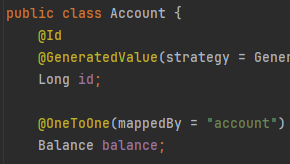
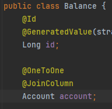
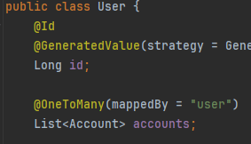
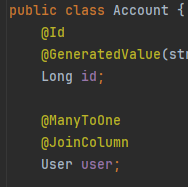
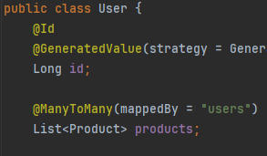
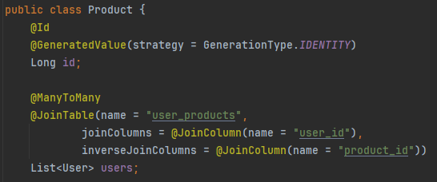
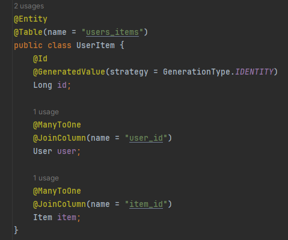
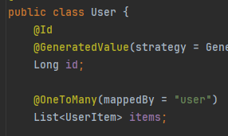
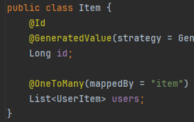

# Relationships
## @One-To-One
+ **Account** has one **Balance**

+ **Balance** belongs to **Account**

## @One-To-Many и @Many-To-One
+ **User** has many **Account**

+ **Account** belongs to **User**

## @Many-To-Many (1-st option)

**User** owns **Product**:

**Product** belongs to **User**:

## @Many-To-Many (2-nd option)
**UserItem** table:

**User**:

**Item**:

